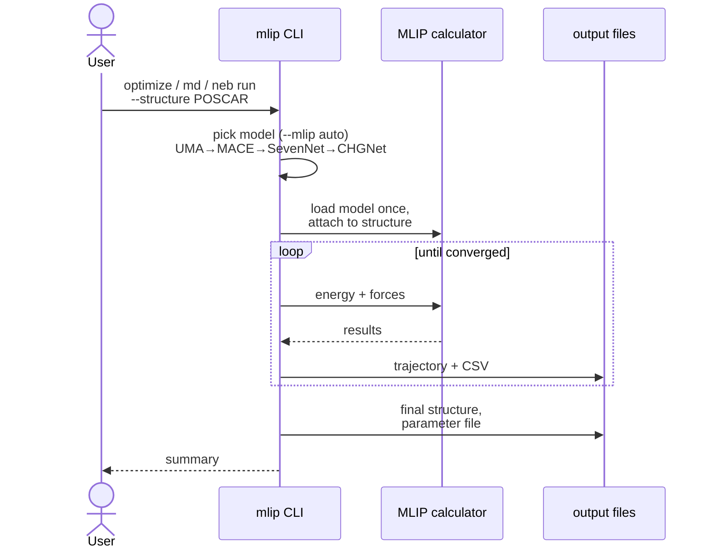

# mliprun

[](https://github.com/manuelarcer/mliprun/actions/workflows/tests.yml)
[](https://github.com/manuelarcer/mliprun/actions/workflows/install-smoke.yml)

A modular CLI toolkit for evaluating Machine Learning Interatomic Potentials (MLIPs) via:

- **Geometry Optimization**
- **Molecular Dynamics (MD)** with NVE, NVT, and NPT ensembles
- **Nudged Elastic Band (NEB) simulations** with restart support
- **AutoNEB** with dynamic image insertion
- **Benchmarking**

Supports **UMA** (FAIRChem), **MACE**, **SevenNet** (7net), and **CHGNet** models with automatic detection and streamlined CLI using [Typer](https://typer.tiangolo.com/).

---

## Key Features

- Unified CLI commands: `optimize run`, `md run`, `neb run`, `autoneb run`
- Auto-detection of available MLIP models (UMA > MACE > SevenNet > CHGNet)
- UMA model support with multiple task types (OMat, OC20, OMol, ODAC)
- MACE multi-head foundation models (`mace-mh-*`) with selectable heads (`omat_pbe`, `oc20_usemppbe`, `matpes_r2scan`, …)
- GPU/CPU selection via `--device` (`auto`/`cuda`/`cpu`) on all run commands
- Geometry optimization with multiple optimizers (FIRE, BFGS, LBFGS, BFGSLineSearch, GPMin, MDMin)
- MD with NVE, NVT, and NPT ensembles
- Configurable thermostats (Langevin, Nose-Hoover, Berendsen) and barostats (MTK NPT, Berendsen NPT)
- NEB with IDPP interpolation, restart support, and highly-constrained mode
- AutoNEB with dynamic image insertion
- CSV output for all simulations; PNG plots are opt-in via `--plot` (CSVs are always written)
- `mlip doctor` environment self-check (installed MLIPs, asetools health, torch/CUDA)
- Lazy imports for fast CLI startup
- Pytest-based test suite with EMT-based unit tests and MLIP integration tests

---

## How it works



---

## Installation

> Setting up with an AI coding assistant (Claude Code, Cursor, Codex, …)? Point it at [AGENTS.md](AGENTS.md) — it covers the install rules, verification, and repo conventions in one place.

### Quick Start

1. **Clone the repository**
```bash
git clone https://github.com/manuelarcer/mliprun.git
cd mliprun
```

2. **Install the package**
```bash
pip install -e .
```

Optional: the NEB interpolation sanity check uses [asetools](https://github.com/manuelarcer/asetools). Enable it with:
```bash
pip install -e ".[neb]"
```

> **Warning**: Never `pip install asetools` directly — the package named `asetools` on PyPI is an unrelated project (Aseprite tooling). The `[neb]` extra pulls the correct one from GitHub. If the wrong one is already installed: `pip uninstall asetools`, then `pip install -e ".[neb]"`.

3. **Install an MLIP model** (each in its own environment — see [install recipes](docs/install/README.md))

```bash
# MACE - readily usable, no access request (good default for a fresh setup)
pip install mace-torch

# UMA models (FAIRChem) - most accurate, but gated on Hugging Face
pip install fairchem-core

# SevenNet
pip install sevenn

# CHGNet
pip install chgnet
```

4. **Verify the install**
```bash
mlip doctor
```

Reports Python/package versions, asetools health, installed MLIP packages, what `--mlip auto` resolves to, and torch/CUDA status. Exits non-zero if no MLIP is installed, so it can be scripted.

> **Note**: With `--mlip auto` (the default), the CLI picks the first available in the order **UMA → MACE → SevenNet → CHGNet**, or you can pass `--mlip <name>` to force a specific one. Prefer one MLIP per environment: the packages pin mutually incompatible torch/e3nn versions, so installing several into one env can silently break — see [ADR 0001](docs/adr/0001-per-mlip-envs.md). UMA is preferred when installed (it is the most accurate), but it is gated on Hugging Face and unusable without an access request — so MACE is placed ahead of SevenNet/CHGNet as the readily-usable fallback. A fresh environment with only `pip install mace-torch` lands on a working model with no access request. UMA's Hugging Face setup is covered in [UMA_USAGE_GUIDE.md](docs/UMA_USAGE_GUIDE.md#2-hugging-face-access).

### Windows Setup

For detailed Windows installation instructions, see: [Windows Setup Guide](docs/windows_setup_guide.md)

---

## CLI Usage

The package installs the following entry points:

- `mlip` — top-level namespace; `mlip --help` lists every subcommand (including `mlip doctor`, the environment self-check)
- `optimize`, `md`, `neb`, `autoneb`, `autoneb-results`, `benchmark` — standalone aliases

`mlip <subcmd>` is equivalent to running `<subcmd>` directly. For example, `mlip md run --structure POSCAR` and `md run --structure POSCAR` do the same thing. The examples below use the standalone form for brevity. All commands support `--help`.

### Common model options

These apply to `optimize`, `md`, `neb`, `autoneb`, and `benchmark`:

- `--mlip`: Model tag. `auto` (default) picks the first installed in order **UMA → MACE → SevenNet → CHGNet** (UMA preferred when present, MACE as the readily-usable fallback), or pass an explicit tag: any `uma-*` (e.g. `uma-s-1p2`), `mace` (MACE-MP-0), `mace-mh-1` (multi-head foundation), `7net-mf-ompa`, `chgnet`.
- `--uma-task`: Task head for UMA models — `omat` (default, bulk inorganic), `oc20` (catalysis/surfaces), `omol` (molecules), `odac`. Ignored for non-UMA models.
- `--mace-head`: Head for multi-head MACE models (`mace-mh-*`) — `omat_pbe` (default), `oc20_usemppbe`, `matpes_r2scan`, `mp_pbe_refit_add`, `omol`, `spice_wB97M`. Ignored for plain `mace`.
- `--device`: `auto` (default; cuda if available, else cpu), `cuda`, or `cpu`. On multi-GPU nodes set `CUDA_VISIBLE_DEVICES` to choose the GPU. (`neb` is the exception: it defaults to `cpu`, so pass `--device cuda` explicitly for GPU NEB runs.)
- `--plot / --no-plot`: write PNG figures of the results. **Off by default** (plotting is opt-in) — the CSV data is always written, so pass `--plot` only when you want the figures. Applies to `optimize`, `md`, and `neb`.

**Example (multi-head MACE on a catalysis surface, forced to GPU):**
```bash
optimize run --structure POSCAR --mlip mace-mh-1 --mace-head oc20_usemppbe --device cuda
```

### Geometry Optimization
```bash
optimize run --structure path/to/structure.vasp
```

**Key options:**
- `--mlip`: Model choice (default: `auto`; explicit options include `uma-s-1p2`, `mace`, `7net-mf-ompa`, `chgnet`)
- `--optimizer`: Algorithm (default: `bfgs`; also `fire`, `lbfgs`, `bfgsls`, `gpmin`, `mdmin`)
- `--fmax`: Force convergence threshold in eV/Å (default: `0.05`)
- `--max-steps`: Maximum optimization steps (default: `200`)
- `--relax-cell`: Also relax the simulation cell (VASP ISIF=3-equivalent), wrapping the atoms in ASE's `FrechetCellFilter`. Off by default (positions only).
- `--plot`: also write the `*_convergence.png` figure (off by default; the `*_convergence.csv` is always written). The plot is per-structure IO that dominates short relaxations, so it is opt-in.

**Example (positions only):**
```bash
optimize run --structure POSCAR --mlip uma-s-1p2 --optimizer fire --fmax 0.05
```

**Example (full cell + positions relaxation):**
```bash
optimize run --structure POSCAR --relax-cell --optimizer fire --fmax 0.02
```

**Outputs:** `opt.traj`, `opt.log`, `opt_convergence.csv`, `opt_final.vasp`, `CONTCAR`, `opt_params.txt` (plus `opt_convergence.png` with `--plot`)

(`CONTCAR` is a copy of the final structure, named so a follow-up DFT run managed by asetools can restart from the directory.)

#### Batch relaxations (load the model once)

Relax many structures in a single process, loading the MLIP model **only once** and reusing it across every relaxation. Each immediate subdirectory of `--parent` holds one input structure:

```bash
optimize batch --parent runs/ --mlip uma-s-1p2 --fmax 0.05
```

- `--input-name`: glob for the input inside each subdir (default `*.vasp`, i.e. exactly one `.vasp` file per subdir; the platform's own `*_final.vasp` outputs are ignored). Use e.g. `POSCAR` for a fixed name.
- `--skip-existing`: skip subdirs that already have a `CONTCAR` (resume a partial batch).
- `--plot`: also write the per-structure convergence PNG for every relaxation (off by default — skipping it gives a measured ~3x speedup on frozen-surface site scans, where the plot cost more per job than the model load).
- A structure that errors or fails to converge is logged and the batch continues; results are summarized in `batch_summary.csv` written into `--parent`.

---

### Molecular Dynamics
```bash
md run --structure path/to/structure.vasp
```

**Key options:**
- `--ensemble`: MD ensemble (`nve`, `nvt`, `npt`)
- `--temperature`: Temperature in K (for NVT/NPT)
- `--pressure`: Pressure in GPa (for NPT)
- `--steps`: Number of MD steps
- `--timestep`: Timestep in fs
- `--thermostat`: For NVT (`langevin`, `nose-hoover`, `berendsen`)
- `--barostat`: For NPT (`npt`, `berendsen`)
- `--log-interval`: Append a row to `md_energy.csv` every N steps (default: 10)
- `--traj-interval`: Write a frame to `md.traj` every N steps (default: 100)
- `--resume`: Continue an existing run — loads the last frame of `md.traj`, preserves momenta, and treats `--steps` as *additional* steps
- `--mlip`: Model choice (default: `auto`)
- `--plot`: also write the `md_energy` / `md_temperature` (and NPT `md_pressure` / `md_volume`) PNGs (off by default; `md_energy.csv` is always written)

For the full MD parameter list, defaults, recommended values for solids, and worked examples, see [MD_REFERENCE.md](docs/MD_REFERENCE.md).

**Example (NVT with Langevin thermostat):**
```bash
md run --structure POSCAR --ensemble nvt --temperature 300 --steps 5000 --thermostat langevin
```

**Example (NPT with Berendsen barostat):**
```bash
md run --structure POSCAR --ensemble npt --temperature 300 --pressure 0.0 --steps 10000 --barostat berendsen
```

**Example (extend a finished run by 5000 more steps):**
```bash
md run --structure POSCAR --resume --steps 5000
```

**Outputs:** `md.traj`, `md_energy.csv`, `md_params.txt` (with `--plot`, also `md_energy.png`, `md_temperature.png`, and for NPT `md_pressure.png` / `md_volume.png`)

---

### Nudged Elastic Band (NEB)
```bash
neb run --initial path/to/initial.vasp --final path/to/final.vasp
```

**Key options:**
- `--num-images`: Number of intermediate images (default: 5)
- `--fmax`: Force convergence threshold (default: 0.05)
- `--mlip`: Model choice (default: `auto`)
- `--k`: Spring constant (default: 0.1)
- `--climb / --no-climb`: Climbing image NEB (default: enabled)
- `--neb-optimizer`: Optimizer for NEB (`fire`, `mdmin`, `bfgs`, `lbfgs`)
- `--neb-max-steps`: Maximum NEB steps
- `--optimize-endpoints / --no-optimize-endpoints`: Pre-optimize endpoints (default: enabled)
- `--device`: Compute device for the MLIP calculator — `cpu` (default) or `cuda`. Unlike `optimize`/`md` (which default to `auto`), NEB runs on CPU unless you pass `--device cuda`.
- `--mace-head`: Head for multi-head MACE models (`mace-mh-*`), same values as the other commands.
- `--plot`: also write `neb_convergence.png` and `neb_energy.png` (off by default; `neb_convergence.csv` and `neb_data.csv` are always written — the CSV is usually enough to inspect the barrier).

The band uses ASE's `improvedtangent` NEB tangent method (not the older default `aseneb`).

**Example:**
```bash
neb run --initial POSCAR_A --final POSCAR_B --num-images 7 --fmax 0.05 --mlip uma-s-1p2
```

**Outputs:** `A2B.traj`, `A2B_full.traj`, `neb.log`, `neb_convergence.csv`, `neb_data.csv`, `neb_parameters.txt`, POSCAR files (`00/`, `01/`, ...) (with `--plot`, also `neb_convergence.png` and `neb_energy.png`)

#### NEB Restart

Resume a previous NEB calculation with optional parameter overrides:

```bash
neb run --restart
neb run --restart --fmax 0.03 --neb-max-steps 1000
neb run --restart --mlip mace         # Warning: changes MLIP model
```

The restart mechanism:
- Loads images from `A2B_full.traj` and parameters from `neb_parameters.txt`
- Creates a timestamped backup of previous results (`bkup_YYYY.MM.DD_HH.MM.SS/`)
- Allows overriding: `--mlip`, `--fmax`, `--k`, `--climb`, `--neb-optimizer`, `--neb-max-steps`
- Forbids changing: `--initial`, `--final`, `--num-images`, `--relax-atoms`, `--optimize-endpoints`

#### Highly-Constrained NEB

For studying diffusion where most atoms should be fixed:

```bash
neb run --initial POSCAR_A --final POSCAR_B --relax-atoms 0,1,5 --no-optimize-endpoints
```

This fixes all atoms except the specified indices and uses linear interpolation (skips IDPP).

---

### AutoNEB
```bash
autoneb run --initial path/to/initial.vasp --final path/to/final.vasp
```

AutoNEB automatically adds intermediate images until `n_max` is reached, making it ideal for complex reaction pathways.

**Key options:**
- `--n-max`: Target number of images including endpoints (default: 9)
- `--n-simul`: Parallel relaxations (default: 1, requires MPI for >1)
- `--fmax`: Force convergence threshold (default: 0.05)
- `--space-energy-ratio`: Geometric vs energy gap preference for image insertion (default: 0.5)
- `--interpolate-method`: `linear` or `idpp` (default: `idpp`)
- `--prefix`: Output file prefix (default: `autoneb`)

**Example:**
```bash
autoneb run --initial POSCAR_A --final POSCAR_B --n-max 11 --fmax 0.03
```

**Outputs:** `autoneb*.traj` files, `AutoNEB_iter/` folder, `autoneb_parameters.txt`

**Note:** Custom convergence plots are not generated in AutoNEB mode.

---

### AutoNEB Results
```bash
autoneb-results results --directory path/to/results
```

Extract and visualize results from a completed AutoNEB calculation:
- Reads final images from `autoneb*.traj` files
- Calculates energy profile and barrier height
- Generates energy profile plot and CSV
- Optionally exports images as VASP POSCAR files (`--export-poscars`)

---

### Benchmark

```bash
benchmark run --structure path/to/structure.vasp
```

Times a single ``get_potential_energy()`` call for each MLIP installed in the current environment (UMA, SevenNet, MACE, CHGNet). Runs in-process — no working-directory or external script dependency.

**Key options:**
- `--models`: Comma-separated MLIP tags to benchmark (default: every installed MLIP).
- `--uma-task`: UMA task head used for `uma-*` models (default: `omat`).
- `--output`: Optional path for a JSON results file.

**Example:**

```bash
benchmark run --structure POSCAR --models mace,uma-s-1p2 --output bench.json
```

A model that fails to load is recorded in the JSON summary with the exception message; other models continue.

---

## Testing

Install the test dependencies first (`[dev]` brings pytest and the coverage tools; `[neb]` the optional asetools):
```bash
pip install -e ".[dev,neb]"
```

Run all unit tests (no MLIP required):
```bash
pytest -m "not uma and not mace and not sevenn"
```

Run all tests including UMA integration:
```bash
pytest
```

Run specific test categories:
```bash
pytest tests/test_core_optimize.py     # Optimization tests (EMT)
pytest tests/test_core_md.py           # MD tests (EMT)
pytest tests/test_core_neb.py          # NEB tests (EMT)
pytest tests/test_neb_restart.py       # Restart logic tests
pytest tests/test_cli_commands.py      # CLI help/argument tests
pytest -m uma                          # UMA integration tests only
```

---

## Scientific Use Cases

- **Optimization**: Relax atomic structures to minimum energy configurations
- **MD**: Simulate temperature and pressure-dependent atomic dynamics
- **NEB**: Compute Minimum Energy Pathways (MEP) and transition barriers
- **AutoNEB**: Automatically find complex reaction pathways with adaptive image insertion
- **Benchmarking**: Compare MLIP model performance

---

## Python API

The CLI commands are thin wrappers over a small set of public functions and one class. To call them directly from a script or notebook, see [PYTHON_API.md](docs/PYTHON_API.md). It covers `setup_calculator`, `run_optimization`, `run_md` / `setup_dynamics`, the `CustomNEB` class, parameter-file helpers, and small utilities.

---

## Output Files

For a complete reference of every file each command writes — filename, format, and which command produces it — see [OUTPUTS.md](docs/OUTPUTS.md). It also documents the (different) output-directory conventions: `optimize` and `md` write next to the input structure; `neb` and `autoneb` write into the current working directory.

---

## Developer Notes

- CLI powered by [`typer`](https://typer.tiangolo.com/)
- Entry points defined in [pyproject.toml](pyproject.toml) (`[project.scripts]`):
  ```toml
  [project.scripts]
  mlip = "mliprun.cli.main:app"
  md = "mliprun.cli.commands.md:app"
  neb = "mliprun.cli.commands.neb:app"
  autoneb = "mliprun.cli.commands.autoneb:app"
  autoneb-results = "mliprun.cli.commands.autoneb_results:app"
  benchmark = "mliprun.cli.commands.benchmark:app"
  optimize = "mliprun.cli.commands.optimize:app"
  ```
- Lazy imports for fast CLI startup (no heavy dependencies loaded until needed)
- Output locations: `optimize`/`md` write next to the input structure; `neb`/`autoneb` write into the current working directory (see [OUTPUTS.md](docs/OUTPUTS.md))
- Plots are opt-in via `--plot`; CSV data is always written
- Shared utilities in `core/utils.py` (fmax calculation, unit conversions)
- Parameter I/O in `core/params_io.py` (reduces duplication across commands)
- Optional integration with [asetools](https://github.com/manuelarcer/asetools) for NEB interpolation sanity checks (`pip install -e ".[neb]"`; the import in `core/neb.py` is guarded, so the platform runs without it)

---

## Changelog

Release notes are tracked in [CHANGELOG.md](CHANGELOG.md). Current version: **0.3.0** (`pyproject.toml`).

## Contributing

See [CONTRIBUTING.md](CONTRIBUTING.md) for development setup, test markers, code conventions, and PR expectations.

---

## Acknowledgments

We gratefully acknowledge the contributions of:

- **Yifan Niu** (National University of Singapore) - Windows setup documentation and testing
- **Lee Yuan Zhang** (National University of Singapore) - Development and testing support

Special thanks to all contributors who have helped improve this platform.
